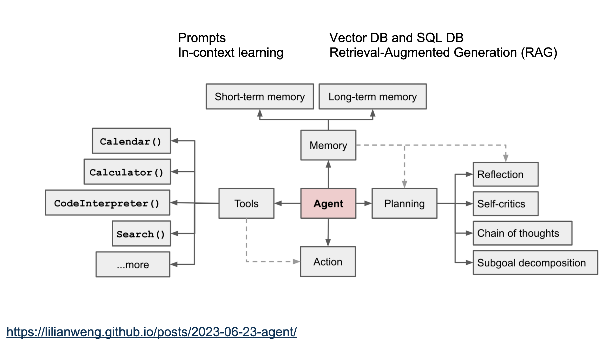
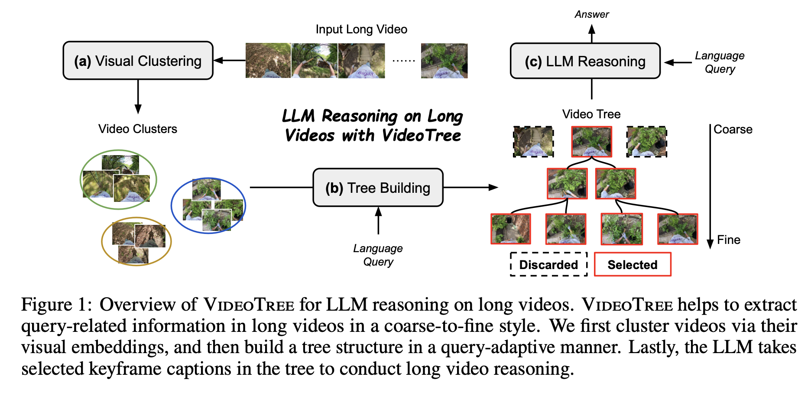
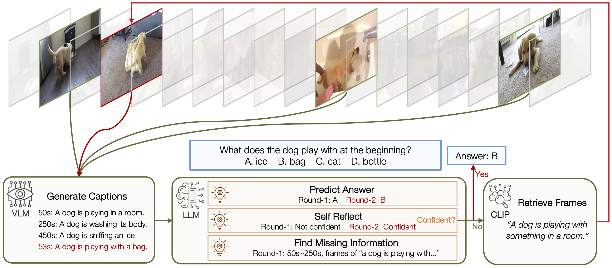
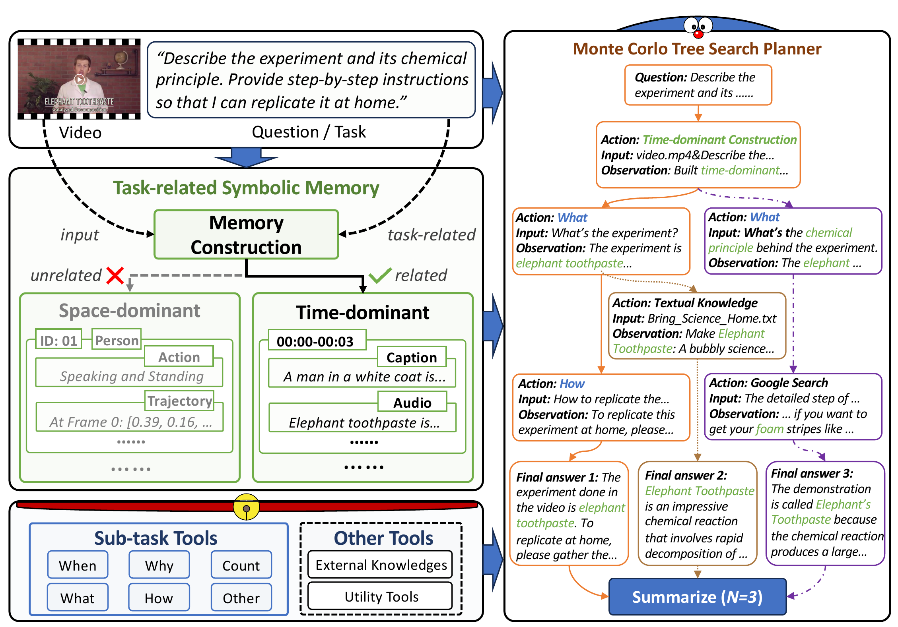
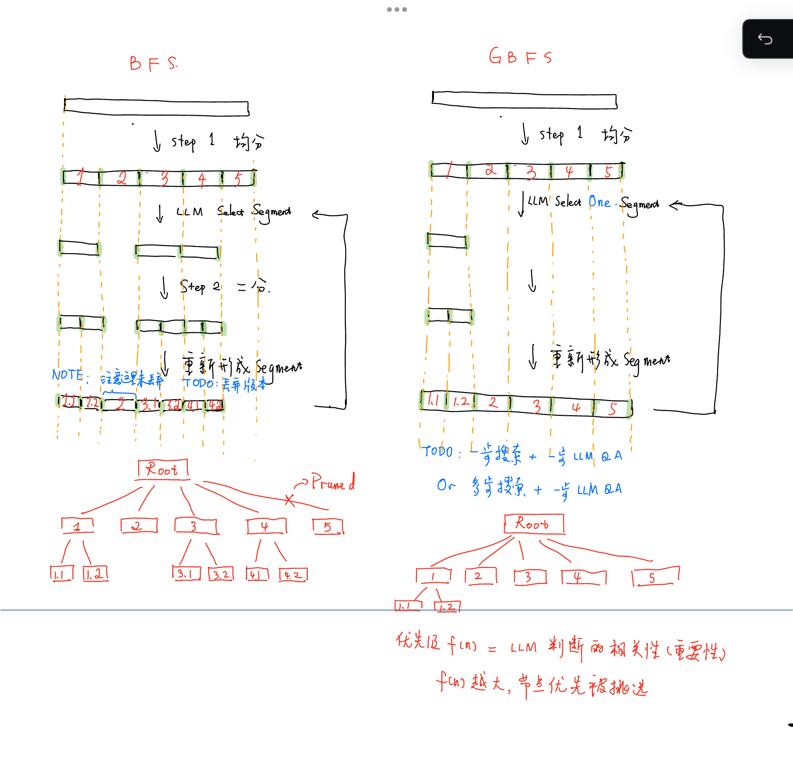
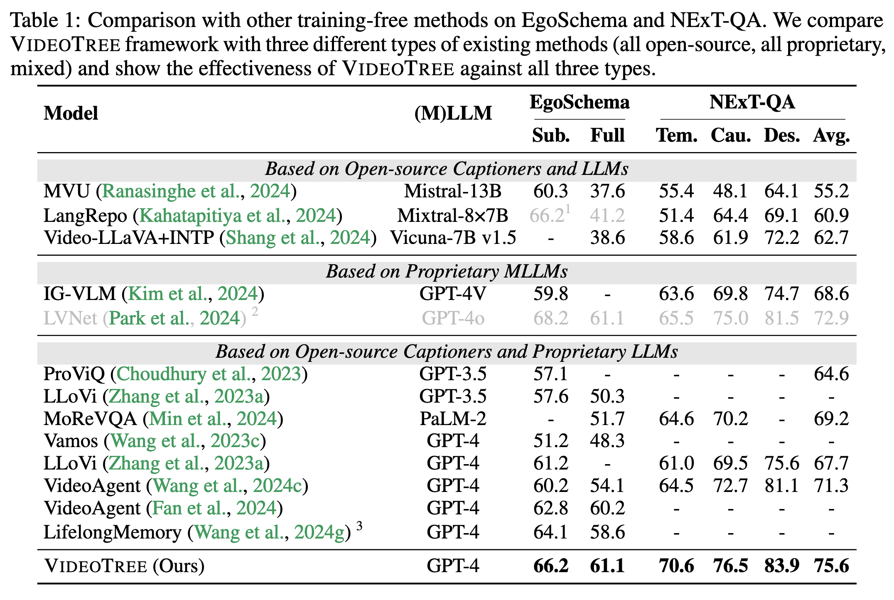
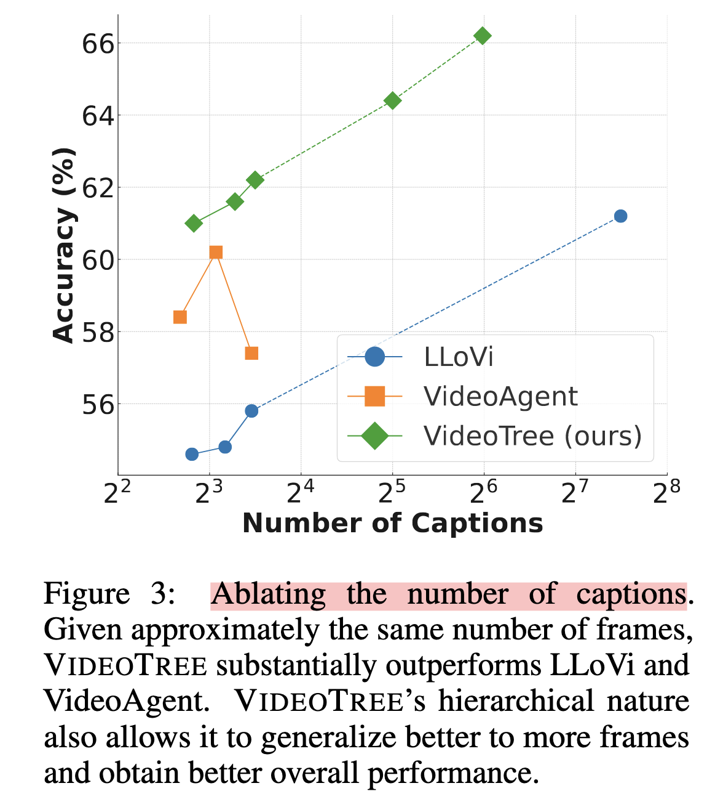

# 🌲TreeVideoAgentPublic

## News and Todo🗓️

\- [x] Release Code for Demo

\- [ ] Release Code for EgoSchema

\- [ ] Release Code for NExT-QA

## 引入

**Video Agent 的概念**：用于视频理解、视频分析的智能体，具备下图所示智能体的基本要素。



难点：

+ **长视频中，基于问题，怎样定位相关内容？**
  + 定位分为时序和空间两个维度上，本文主要讨论**时序定位**
+ **如何减少开销，如降低 MLLM token 的消耗？**
  + 开销比较：tools < image-MLLM < large video-language model

针对两个难点，提出的解决方案：

+ **对视频的树形搜索**

  + 用 image-MLLM 解决 video understanding 任务，需要挑选出与问题最相关的视频切片或帧。
  + 把视频切片（[```VideoSeg```](https://github.com/fansunqi/TreeVideoAgent/blob/main/video_seg.py)）作为树节点，解答问题的关键信息作为搜索目标

+ **对工具的树形搜索**：

  + 工具包括 image captioner, summarizer, google_search, detector, tracker, mobile_sam, text_detector (OCR), patch zoomer, python interpreter, clip...  

    如何搜索出一条最佳的工具链条，对应解决问题的最优步骤。

  + 难点在于**工具在 LLM 中的注册**，一般是 prompt 与微调两种方案。

    相关工作 [OctoTools - 制作工具卡片](https://octotools.github.io/), AutoGen, GPT-Functions, LangChain 等架构

    

## 相关工作

+ 【Preprint 2024.10】[VideoTree: Adaptive Tree-based Video Representation for LLM Reasoning on Long Videos](https://videotree2024.github.io/)

  视频 -> 根据 image feature 进行 k-means 聚类，构造成静态的树 -> LLM 沿树搜索

  不足：

  + **针对一个视频预先建好静态的树，预处理消耗较大**，可改为动态建树
  + VideoTree 和 VideoAgent 都对所有帧过了 CLIP ，速度过慢（尤其是 VideoTree，涉及多次提取特征与聚类），不能在线回答问题 

  

+ 【ECCV 2024】[VideoAgent: Long-form Video Understanding with Large Language Model as Agent](https://wxh1996.github.io/VideoAgent-Website/)

  LLM-Agent 通过反思、自我评价等手段，挑选帧

  不足：

  + VideoTree 和 VideoAgent 都对所有帧过了 CLIP ，速度过慢，不能在线回答问题 

  

+ 【ICML 2024】[DoraemonGPT : Toward Understanding Dynamic Scenes  with Large Language Models (Exemplified as A Video Agent)](https://z-x-yang.github.io/doraemon-gpt/)

  对视频分析工具链的搜索

  


## 算法 Formulation




## 数据集

+ [EgoSchema](https://github.com/egoschema/EgoSchema)
+ [NextQA](https://github.com/doc-doc/NExT-QA) 


## 评价指标

+ Accuracy：回答问题的准确率
+ Frame Efficiency：回答一个问题使用了 / 需要多少帧，越少越好。考察 video agent 的时间定位能力。


## 试验结果

### EgoSchema Subset

#### 主结果

|                  | VideoTree | VideoAgent | Mine - BFS | Mine - GBFS |
| ---------------- | --------- | ---------- | ---------- | ----------- |
| Acc              | 66.2      | 60.2       | 68.24      |             |
| Frame Efficiency | All (180) | 8.4        | 26.82      |             |

#### Baselines

（From [VideoTree](https://videotree2024.github.io/)）

#### Accuracy 和 # Frame 的关系图



（From [VideoTree](https://videotree2024.github.io/)）


## 可视化

