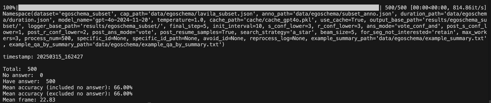
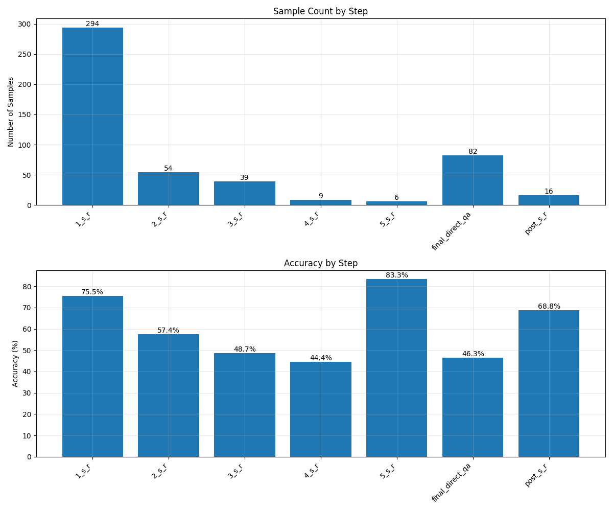

# 🌲 TreeVideoAgent

## News and Todo 🗓️

- [ ] Release Code for Demo

- [ ] Release Code for EgoSchema

- [ ] Release Code for NExT-QA

## Installation Steps 🛠️

Our TreeVideoAgent does not require many computational resources; it can run on a personal computer without GPU.

1. Clone the repository 📦:

   ```python
   git clone git@github.com:fansunqi/TreeVideoAgentPublic.git
   cd TreeVideoAgentPublic
   ```

2. Create a virtual environment 🧹 and install the dependencies 🧑‍🍳:

   ```python
   python3 -m venv tva_env
   source tva_env/bin/activate
   pip install -r requirements.txt
   ```

3. Set up your API key 🗝️:

   Obtain an OpenAI API key and set  ```OPENAI_API_KEY``` and ```OPENAI_BASE_URL``` as environmental variables in  ```~/.zshrc``` or ```~/.bashrc```. In the ```main.py```, we will use the following codes to obtain the API key and base URL:

   ```
   api_key = os.getenv("OPENAI_API_KEY")
   base_url = os.getenv("OPENAI_BASE_URL")
   ```

## QuickStart 🚀

We present a case demo by running:

```
sh scripts/demo.sh
```

## EgoSchema Experiments 🔬

We obtain the dataset annotations and extracted captions from the File [LLoVi](https://drive.google.com/file/d/13M10CB5ePPVlycn754_ff3CwnpPtDfJA/view?usp=drive_link) provide. We have already placed them in ```data/egoschema/```. 

If you don't want to cost on OpenAI API, we provide our LLM conversation cache [here](https://drive.google.com/file/d/1c_wId28ozyGEQKd5x3Zl8ugmvDVlJSED/view?usp=sharing) and you can specify the cache path in ```arg_parser.py```.

For EgoSchema subset (500 videos), run:

```
sh scripts/egoschema_subset.sh
```

It will run an automated evaluation scripts and output accuracy and mean frame number like this:



For step by step analysis, run:

```
python3 analyze_results.py --filepath YOUR_RESULT_JSON_FILE_PATH
```

It will output a histogram showing the number of problems solved and the accuracy at each step like this:


